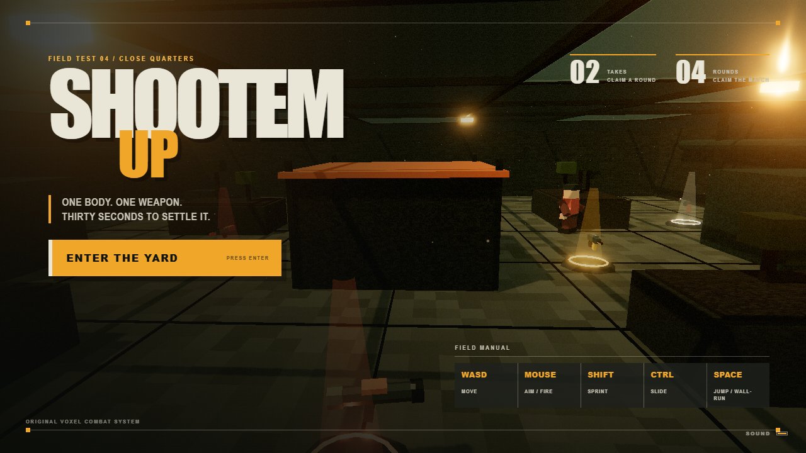

# SHOOTEM UP

SHOOTEM UP is a browser-based voxel first-person arena shooter built around
short, decisive 1v1 duels. Every round moves to a new arena with a different
set of disposable weapons. Win two takes to claim a round; win four rounds to
take the match.



The primary mode is a live, server-authoritative 1v1 duel with quick matching,
private field codes, invite links, opponent interpolation, client prediction,
lag-compensated hit registration, and a 20-second reconnect hold. A complete
practice match against a movement-aware bot remains available from the title
screen.

The game includes sprinting, sliding, wall-running, air control, eight distinct
weapons, three original arenas, synthesized spatial audio, voxel destruction,
dynamic lighting, post-processing, and a complete multi-round match loop.

## Multiplayer

The Node server owns the match clock, phases, scores, health, ammunition,
pickups, rate-of-fire validation, hit tests, rocket simulation, overtime, and
disconnect forfeits. Browsers predict only their own motion, reconcile against
accepted input sequences, and render opponents from a buffered 20 Hz snapshot
stream.

- Quick Duel pairs two waiting players.
- Private Room creates a five-character code and copyable invite URL.
- Reloading or briefly losing the socket reclaims the same session and slot.
- `/api/status` exposes aggregate service health without player-identifying
  information.

## Controls

- `WASD` move
- `Mouse` aim
- `Left mouse` fire
- `Right mouse` focus
- `Shift` sprint
- `Space` jump / wall-run
- `Control` or `C` slide
- `R` discard an empty weapon
- `Escape` pause

## Development

```sh
npm install
npm run dev
```

Run the test suite and production build:

```sh
npm test
npm run build
```

With the production server running, browser and load checks are available:

```sh
npm run test:browser
npm run test:multiplayer
npm run test:performance
npm run test:load
```

Serve the production build on port 8080:

```sh
npm start
```

## Deployment

The included `Dockerfile` and `fly.toml` deploy the production server to
Fly.io. The deployment keeps one authoritative process warm because active
rooms live in that process:

```sh
flyctl deploy
```

## Design note

SHOOTEM UP takes inspiration from the pace and pickup-driven structure of
small-format arena shooters. Its code, arenas, models, effects, sound design,
interface, and visual identity are original.
